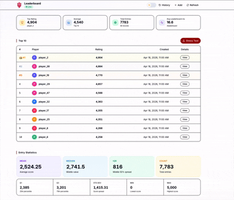

# Luddy Hacks 2026 — Team Enigma

Dynamic leaderboard built in 24 hours. FastAPI + Postgres on the backend, React + Vite on the frontend.

[](https://leaderboard-black-two.vercel.app/leaderboard)
[](http://18.234.66.87:8000/docs)
[](YOUR_YOUTUBE_URL)

<p align="center">
  
</p>

> The frontend is hosted on **Vercel**. The backend (FastAPI + Postgres in Docker Compose) runs on an **AWS EC2 t2.micro**, Ubuntu 24.04. Both links above are live — click them.

## The problem

The brief is a "dynamic leaderboard", which on the surface is a CRUD app. We reframed it around a concrete scaling scenario: **a chess platform leaderboard**.

Imagine a site like Chess.com or Lichess — tens of millions of players, every finished game updates two ratings (both players', via ELO), and every player wants to see their rank the moment the game ends. At that scale the naive implementation falls apart in two specific places:

- **`/info` aggregate stats.** Mean, standard deviation, quartiles, percentile ranks across every player means a full table scan. Slow, and it gets slower as the table grows.
- **Concurrent reads + writes on the same sorted index.** Every finished game is a write; every player checking their rank is a read. Serializing them through a single SQL `ORDER BY` becomes the bottleneck.

Top-10 alone is cheap if you have a `rating` index — Postgres will happily serve that. The interesting work is everything else: keeping running statistics fresh without re-scanning, answering "what's player X's percentile" in log-time, and letting thousands of reads run while writes are still arriving. That's the problem we actually built for.

## Endpoints

| Endpoint | Method | What it does |
|---|---|---|
| `/add` | POST | Add a player + rating |
| `/remove` | DELETE | Remove the most recent entry for a player |
| `/leaderboard` | GET | Top 10 by rating |
| `/info` | GET | Mean, median, std dev, quartiles, IQR, percentile ranks, score distribution |
| `/performance` | GET | Average / min / max latency per endpoint |
| `/history` | GET | Audit log of every add/remove, filterable by player and time range |
| `/stress-test` | POST | Run a Locust load test against the running server (with HTML report) |
| `/health` | GET | Liveness probe |

The full OpenAPI 3.1 spec is in [`openapi.yaml`](./openapi.yaml).

## Our approach

Given the chess-scale framing above, we optimised for the paths that actually hurt at scale — aggregate stats, per-player rank, and read/write concurrency — rather than the path that's already cheap (top-10 with an index). The mechanics:

- **Custom skip list** for the ranking. O(log N) insert, delete, and rank-of queries. Each level pointer carries a span count so per-player percentile in `/info` is cheap.
- **Welford's algorithm** for the running mean and standard deviation — O(1) per `/add`, no recomputing.
- **Quickselect** for percentile values in `/info`. O(N) average instead of sorting.
- **In-memory store backed by a Postgres audit log.** Postgres is the durable source of truth; the in-memory skip list is the live query index. On boot we replay the audit log to rebuild the index (write-ahead log pattern).
- **Async reader-writer lock** so reads run concurrently and writes are exclusive.
- **Write queue + background flusher** so `/add` returns to the client immediately and the DB write happens in the background.
- **`/stress-test` runs Locust in-process** — hit it from Swagger to load-test the running server, then view the HTML report at `/stress-test/report`.

The in-memory + audit log split is what lets reads stay sub-millisecond under heavy write load.

## Run it locally

Pick whichever path is easiest for you.

### Docker Compose (recommended)

```bash
cp .env.example .env          # set DB_PASSWORD at minimum
docker compose up --build
```

Then open `http://localhost:8000/docs` for Swagger, or `http://localhost:8000/leaderboard` for the JSON. Tables auto-create on first boot via SQLAlchemy.

```bash
docker compose down -v        # full teardown, also deletes the DB volume
```

### Bash launcher (no Docker)

```bash
./start.sh
# Backend  → http://localhost:8000
# Frontend → http://localhost:5173
# API docs → http://localhost:8000/docs
```

Requires Python 3.13, Node 18+, and a Postgres you can point `DATABASE_URL` at (Supabase free tier works fine).

### Manual

```bash
# Backend
cd backend
python3 -m venv .venv && source .venv/bin/activate
pip install -r requirements.txt
uvicorn main:app --reload --port 8000

# Frontend (new shell)
cd frontend
npm install
npm run dev
```

## Environment variables

Copy `.env.example` to `.env` and fill in:

| Variable | Notes |
|---|---|
| `DB_PASSWORD` | Postgres password (only when using the bundled `db` service in Compose) |
| `DATABASE_URL` | `postgresql+asyncpg://...` connection string |
| `APP_ALLOWED_ORIGINS` | Comma-separated CORS origins (e.g. `http://localhost:5173`) |
| `DATABASE_READ_URL` | Optional read replica; falls back to `DATABASE_URL` if empty |
| `REDIS_URL` | Optional Redis cache; degrades to no-op if unreachable |

The frontend reads its API URL from `frontend/.env`:

```
VITE_API_URL=http://localhost:8000
```

For the deployed build we point this at the EC2 IP before running `vercel --prod`.

## Repo layout

```
backend/                FastAPI app
  routers/leaderboard.py    All endpoints
  skiplist.py               Custom skip list with span-based rank queries
  stats.py                  Welford + quickselect
  leaderboard_store.py      In-memory store + async reader-writer lock
  write_queue.py            Background batched writes to Postgres
  models.py / database.py   SQLAlchemy setup
  Dockerfile                Multi-stage Python 3.13 image
frontend/               Vite + React + TypeScript + Tailwind + shadcn/ui
openapi.yaml            OpenAPI 3.1 spec for the backend
schema.sql              Postgres DDL (also auto-created on first run)
docker-compose.yml      db + api services
start.sh                Local dev launcher (backend + frontend)
```

## Tests

```bash
cd backend
pytest                  # skip list + stats unit tests
```

A `locustfile.py` is also bundled for external load testing if you'd rather not use the in-process `/stress-test` endpoint.

## How we deployed it

- **Backend** — AWS EC2 t2.micro, Ubuntu 24.04, port 8000. We `scp`'d the `.env`, cloned the repo, and ran `docker compose up -d --build`. Postgres data lives on the instance's gp3 volume.
- **Frontend** — `npm run build` from `frontend/`, then `vercel --prod`. `VITE_API_URL` points at the EC2 public IP.

<details>
<summary><b>Full EC2 provisioning steps (AWS CLI)</b></summary>

#### 1. Create a security group

```bash
YOUR_IP="1.2.3.4"   # your public IP — curl ifconfig.me

SG_ID=$(aws ec2 create-security-group \
  --group-name enigma-sg \
  --description "Enigma leaderboard security group" \
  --query 'GroupId' --output text)

# SSH from your IP only
aws ec2 authorize-security-group-ingress \
  --group-id "$SG_ID" \
  --protocol tcp --port 22 --cidr "${YOUR_IP}/32"

# API open to the world
aws ec2 authorize-security-group-ingress \
  --group-id "$SG_ID" \
  --protocol tcp --port 8000 --cidr 0.0.0.0/0
```

#### 2. Resolve the Ubuntu 24.04 AMI for your region

```bash
REGION=$(aws configure get region)
AMI_ID=$(aws ssm get-parameter \
  --name /aws/service/canonical/ubuntu/server/24.04/stable/current/amd64/hvm/ebs-gp2/ami-id \
  --region "$REGION" \
  --query 'Parameter.Value' --output text)
```

#### 3. Launch the instance

```bash
aws ec2 create-key-pair --key-name enigma-key \
  --query 'KeyMaterial' --output text > enigma-key.pem
chmod 400 enigma-key.pem

INSTANCE_ID=$(aws ec2 run-instances \
  --image-id "$AMI_ID" \
  --instance-type t2.micro \
  --key-name enigma-key \
  --security-group-ids "$SG_ID" \
  --block-device-mappings '[{"DeviceName":"/dev/sda1","Ebs":{"VolumeSize":20,"VolumeType":"gp3"}}]' \
  --tag-specifications 'ResourceType=instance,Tags=[{Key=Name,Value=enigma}]' \
  --query 'Instances[0].InstanceId' --output text)

aws ec2 wait instance-running --instance-ids "$INSTANCE_ID"
PUBLIC_IP=$(aws ec2 describe-instances --instance-ids "$INSTANCE_ID" \
  --query 'Reservations[0].Instances[0].PublicIpAddress' --output text)
```

#### 4. Install Docker on the instance

```bash
ssh -i enigma-key.pem -o StrictHostKeyChecking=no ubuntu@"$PUBLIC_IP" bash << 'ENDSSH'
set -e
sudo apt-get update -qq
sudo apt-get install -y ca-certificates curl gnupg lsb-release
sudo install -m 0755 -d /etc/apt/keyrings
curl -fsSL https://download.docker.com/linux/ubuntu/gpg \
  | sudo gpg --dearmor -o /etc/apt/keyrings/docker.gpg
sudo chmod a+r /etc/apt/keyrings/docker.gpg
echo "deb [arch=$(dpkg --print-architecture) signed-by=/etc/apt/keyrings/docker.gpg] \
  https://download.docker.com/linux/ubuntu $(lsb_release -cs) stable" \
  | sudo tee /etc/apt/sources.list.d/docker.list > /dev/null
sudo apt-get update -qq
sudo apt-get install -y docker-ce docker-ce-cli containerd.io docker-compose-plugin
sudo usermod -aG docker ubuntu
ENDSSH
```

#### 5. Clone, configure, run

```bash
scp -i enigma-key.pem .env ubuntu@"$PUBLIC_IP":~/app.env

ssh -i enigma-key.pem ubuntu@"$PUBLIC_IP" bash << ENDSSH
set -e
sudo apt-get install -y git
git clone https://github.com/dsatyam09/Enigma.git app
cd app
cp ~/app.env .env
sed -i "s|APP_ALLOWED_ORIGINS=.*|APP_ALLOWED_ORIGINS=http://${PUBLIC_IP}|" .env
sudo docker compose up -d --build
ENDSSH
```

#### 6. Verify

```bash
curl http://${PUBLIC_IP}:8000/health         # {"status":"ok"}
curl http://${PUBLIC_IP}:8000/leaderboard    # []
echo "Swagger UI → http://${PUBLIC_IP}:8000/docs"
```

#### Useful ops

```bash
docker compose logs -f api
git pull && docker compose up -d --build api
docker compose exec db psql -U app -d leaderboard
docker compose down -v        # destroys pgdata
```

</details>
